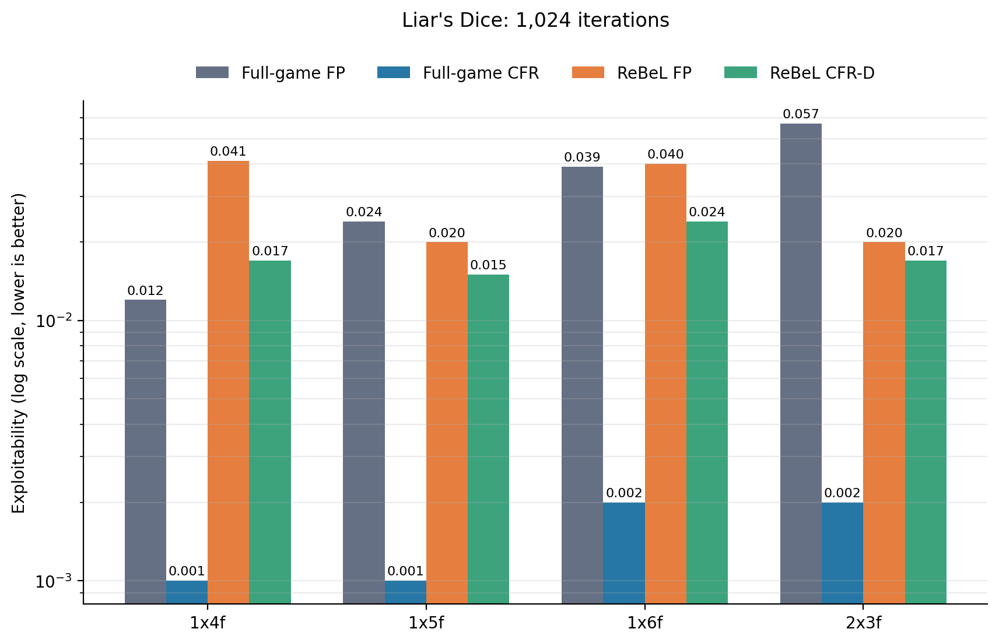
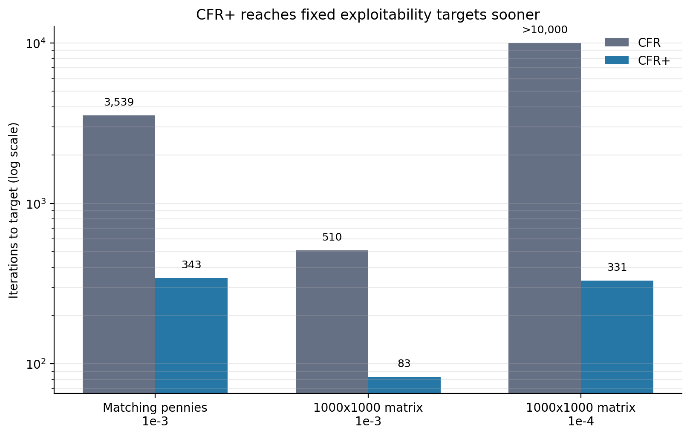
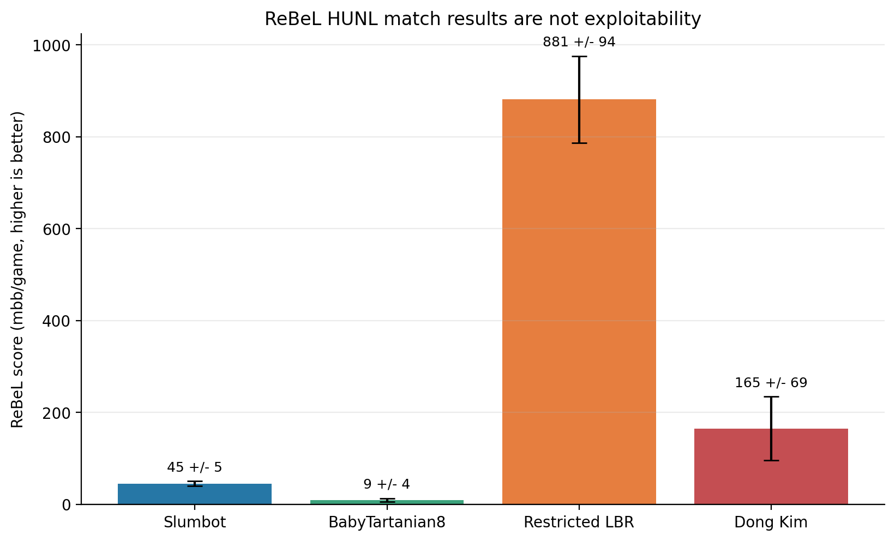
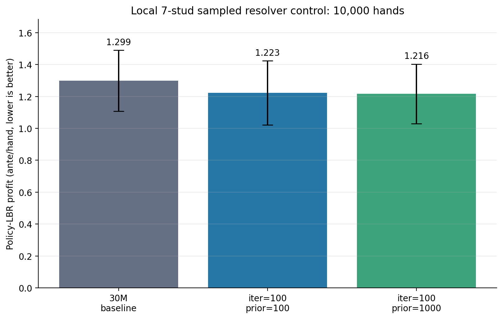

# ReBeL vs. Cepheus seminar discussion notes

## 한 줄 결론

ReBeL은 **2인 제로섬 게임에서 이상화된 조건 아래 Nash equilibrium으로 수렴하는 프레임워크**다. 그러나 Cepheus보다 같은 정확도까지 더 빨리 수렴한다고 말할 근거는 없다. 두 시스템은 게임, 목표, 계산 단위와 평가 지표가 모두 다르다.

- **Cepheus**: 고정된 heads-up limit hold'em 전체를 CFR+로 반복 계산하여 exploitability `0.986 mbb/g`에 도달한 약한 의미의 해법이다.
- **ReBeL**: PBS를 상태로 삼아 제한 깊이 subgame을 CFR로 풀고 가치망으로 경계를 근사한다. heads-up no-limit hold'em에서 강한 실전 성능을 보였지만 전체 게임 exploitability는 보고하지 않았다.
- 따라서 올바른 질문은 “어느 쪽의 반복 횟수가 적은가?”보다 **“전체 전략표를 저장할 수 없는 게임에서 어느 정도의 근사 오차를 감수하고 일반화와 online search를 얻는가?”**다.

## 수렴 보장의 정확한 범위

ReBeL 논문의 이론은 다음 조건에 기대고 있다.

1. 게임은 2인 제로섬이고 perfect recall을 만족한다.
2. public belief state(PBS)와 정책으로 유도되는 range를 정확히 다룬다.
3. 각 depth-limited subgame을 `T`회의 CFR로 푼다.
4. 정리 2는 최근 표본값을 정확히 기억하는 이상화된 value approximator를 사용한다.
5. 정리 3은 test-time leaf PBS의 가치 오차가 모든 관련 상태에서 `delta` 이하라고 가정한다.
6. test time에는 off-policy exploration을 사용하지 않고, CFR 평균 전략과 기대상 동등하도록 반복 하나를 표본화한다.
7. 부록은 실험에서 효율을 위해 수정한 CFR-AVG가 이론적으로 sound한지는 열린 문제라고 명시한다.

이 조건에서 오차의 구조는 다음처럼 요약할 수 있다.

\[
\varepsilon_{\text{ReBeL}}
= O(\delta) + O(T^{-1/2}),
\]

여기서 `delta`는 value approximation 및 재귀 경계 오차이고, `T`는 각 subgame의 CFR 반복 수다. 즉 **신경망을 붙였기 때문에 CFR보다 더 빠른 이론적 rate가 생기는 것은 아니다.** 신경망은 여러 PBS 사이에서 값을 일반화하여 전체 게임을 매번 펼치지 않게 해 주는 압축 장치에 가깝다.

실제 HUNL 구현은 유한한 학습 데이터, 함수 근사, 최대 9개 행동으로 축소한 action space를 사용한다. 그러므로 논문의 실전 성능과 이상화된 수렴 정리를 같은 주장으로 읽으면 안 된다.

또 하나의 발표용 주의점이 있다. 정리 3의 표시식은 `delta*C1 + delta*C2/sqrt(T)`처럼 인쇄되어 있지만, 바로 뒤 증명은 `k2*delta + k3/sqrt(T)`를 도출한다. `delta=0`인 유한 `T`에서 exact equilibrium이 된다는 해석은 모순이므로, 발표에서는 위와 같이 **`O(delta) + O(T^-1/2)` 구조**로 설명하는 것이 안전하다.

Cepheus도 비슷한 구분이 필요하다. CFR+의 선형 가중 평균 전략에는 수렴 정리가 있지만, 실제 Cepheus는 저장량을 줄이기 위해 current strategy를 사용했다. current strategy의 일반 수렴 조건은 알려져 있지 않다. 다만 최종 current strategy의 full-game exploitability를 직접 계산하여 결과 자체를 인증했다.

## Cepheus와 직접 속도 비교가 안 되는 이유

| 축 | Cepheus | ReBeL | 비교상의 문제 |
|---|---|---|---|
| 게임 | Heads-up **limit** hold'em | Heads-up **no-limit** hold'em | game tree와 action space가 다름 |
| 목표 | 고정 게임을 사실상 weakly solve | 여러 PBS에서 search 가능한 강한 정책 | 종료 기준이 다름 |
| 핵심 계산 | full-game tabular CFR+ sweep | self-play, value learning, depth-limited CFR | iteration 한 번의 비용이 다름 |
| 이론적 rate | CFR와 같은 `O(T^-1/2)`, 실무상 CFR+가 빠름 | CFR search error와 value error의 합 | ReBeL 자체가 더 빠른 regret minimizer는 아님 |
| 품질 지표 | exact exploitability `0.986 mbb/g` | HUNL match score와 제한된 LBR | 동일 epsilon을 비교할 수 없음 |
| 공개 계산량 | 4,800 CPU cores, 68.5일, 약 900 core-years | HUNL data generation 90 DGX-1 x 8 V100, 1,750 epochs | ReBeL 논문에 비교 가능한 총 wall time이 없음 |
| 저장·실행 | 약 10.9 TiB의 압축 전략/후회 값 | 가치·정책망과 online search | 저장량과 추론 비용의 교환 |

따라서 다음 정도만 말할 수 있다.

- **고정 게임의 표를 감당할 수 있고 아주 낮은 exploitability가 목표라면** Cepheus식 CFR+가 더 직접적이고 검증 가능하다.
- **전체 표가 불가능하거나 stack/bet size가 바뀌는 게임이라면** ReBeL이 PBS 사이의 일반화와 online resolving으로 더 실용적일 수 있다.
- 이것은 “더 빠른 수렴”이라기보다 **같은 문제를 전부 저장하지 않고 근사적으로 푸는 다른 계산 전략**이다.

## 그래프 1: ReBeL의 작은 게임 exploitability



ReBeL 논문 표 2의 원자료다. 모든 방법이 1,024회의 반복을 사용했을 때 full-game CFR가 네 게임 모두에서 ReBeL CFR-D보다 낮은 exploitability를 기록했다. 논문도 같은 반복 수에서는 tabular CFR가 더 낫다고 명시한다.

이 그래프의 메시지는 “ReBeL이 반복당 더 빨리 수렴한다”가 아니라, **full-game traversal이 커져서 불가능해질 때 재귀 근사로 계산 가능성을 유지한다**는 것이다. ReBeL 값은 1,024개 sampled policy의 평균으로 계산된 exploitability 상한이다.

## 그래프 2: CFR+ 자체의 실무상 가속



Cepheus의 핵심 알고리즘인 CFR+는 이론적으로 CFR와 같은 점근 rate를 갖지만, 작은 benchmark에서는 목표 exploitability에 훨씬 적은 반복으로 도달했다.

- Matching pennies, `1e-3`: CFR `3,539`, CFR+ `343`, 약 `10.3x`
- 1,000 x 1,000 random matrix, `1e-3`: CFR `510`, CFR+ `83`, 약 `6.1x`
- 1,000 x 1,000 random matrix, `1e-4`: CFR는 `10,000`회 안에 실패, CFR+ `331`, 따라서 최소 `30.2x`

이는 **CFR+와 CFR의 비교**이지 Cepheus와 ReBeL의 비교가 아니다.

## 그래프 3: ReBeL HUNL 실전 결과



양수는 ReBeL의 수익이며 단위는 `mbb/game`이다. 이 결과는 ReBeL이 강하다는 증거지만 Nash 근접도의 직접 측정은 아니다.

- 상대마다 강도와 제약이 다르므로 bar 높이를 서로 직접 비교하면 안 된다.
- LBR은 첫 두 betting round에서 call하도록 제한된 평가자다.
- Dong Kim 결과는 7,500 hands와 AIVAT 분산 감소를 사용했다.
- HUNL 전체 exploitability는 계산되지 않았다.
- 본문 Table 1은 `±`를 standard deviation이라고 설명하지만, supplemental의 Dong Kim 절은 `165 ± 69`를 standard error라고 설명한다. 발표에서는 논문 표기값이라고만 부르는 편이 안전하다.

## 그래프 4: 7-stud 7th-street local resolver 대조 실험



현재 로컬 결과에서는 240 evaluator particles와 10,000 paired-seat hands에서 resolver의 point estimate가 baseline보다 약 `5.9%`와 `6.4%` 낮았다. 그러나 95% confidence interval이 크게 겹치며 per-hand paired return을 저장하지 않아 통계적으로 개선을 확정할 수 없다.

중요하게도 이 그림의 정책은 **particle PBS ReBeL이 아니라 determinized exact-key sampled resolver**다. PBS 구현으로 넘어가기 전의 local-solving control experiment로만 제시해야 한다.

더 넓은 64-particle sweep은 [`seventh_resolver_sweep.png`](../../cpp_mccfr/results/seventh_resolver_sweep_10k64/seventh_resolver_sweep.png)를 참고한다. 반복 수가 증가해도 LBR lower bound가 단조롭게 감소하지 않는다.

별도의 1,000-hand PBS smoke에서는 particle 수를 64에서 240으로 늘릴 때 local coverage가 `64.6%`에서 `72.7%`로 증가했고 LBR point estimate는 `0.847`에서 `0.756`으로 낮아졌다. 다만 SE가 각각 `0.262`, `0.232`로 매우 크므로 성능 결론보다 coverage와 bounded memory 검증에 의미가 있다.

현재 `6th + V7` 재귀 실험은 다음 병목을 보였다.

| 지표 | 결과 | 해석 |
|---|---:|---|
| Constant value MAE | 4.974 ante | V7 비교 기준 |
| V7 held-out MAE | 4.709 ante | 약 5.3% 개선에 그침 |
| 7th-only LBR | 1.2227 ± 0.1029 | local control |
| 6th + V7 LBR | 1.2432 ± 0.1089 | 추가 개선을 입증하지 못함 |
| 6th posterior ESS | 10.90 / 64 | 약 17%, particle degeneracy |
| Policy misses | 4,372,300 / 22,639,920 | 약 19.3% |
| V7 calls | 5,145,824 | 약 515 calls/hand |
| 총 실행 시간 | 2,924 s | 약 48.7분 |

여기서 평균 MAE `4.709`는 모든 leaf PBS에 대한 uniform error bound `delta`가 아니다. 따라서 이를 ReBeL 정리에 대입할 수 없다. 자세한 경로와 원자료는 [`REBEL_RECURSIVE_7STUD.md`](../../cpp_mccfr/REBEL_RECURSIVE_7STUD.md)에 있다.

현재 구현은 다음 이유로 ReBeL 정리의 보장 대상이 아니다.

- exact private range 대신 particle posterior 사용
- private-state bucketing 사용
- local policy coverage 밖에서 blueprint fallback
- H4 likelihood heuristic 사용
- exact exploitability가 아닌 제한된 policy-LBR lower bound 사용
- 7th-street PBS control 자체는 value network가 없는 terminal solver이고, `6th + V7`도 아직 5th/V6가 없는 부분 재귀 구현

따라서 이 결과는 “ReBeL 수렴 검증”이 아니라 **PBS 구성과 local resolving의 초기 검증**으로 제시해야 한다.

## 발표 순서

1. **문제 제기**: “ReBeL은 수렴한다. 그러면 Cepheus보다 빠른가?”
2. **정리의 범위**: 이상화된 2인 제로섬, 정확한 PBS, bounded leaf error, CFR 평균 전략.
3. **비교 단위 해체**: HULHE와 HUNL, exploitability와 match score, offline table과 online search.
4. **문헌 데이터**: Liar's Dice에서 full-game CFR가 반복당 더 낮은 exploitability.
5. **CFR+ 데이터**: 같은 점근 rate라도 상수와 weighting이 실무 속도를 크게 바꿈.
6. **ReBeL의 실제 장점**: 범위 일반화, 임의 stack/bet 대응, 전체 전략표 회피.
7. **우리 데이터**: 7th-street point improvement는 있지만 CI가 겹치고 단조 수렴은 아직 없음.
8. **토론**: 수렴 속도의 단위를 무엇으로 정의해야 하는가?

## Discussion 질문

1. 알고리즘을 비교할 때 `iteration`, node visit, wall time, energy, memory 중 무엇을 동일하게 맞춰야 하는가?
2. exact exploitability를 계산할 수 없는 게임에서 “수렴”을 어떤 operational metric으로 대체할 수 있는가?
3. ReBeL의 가치망 오차 `delta`를 학습 중 측정하거나 상한화할 현실적인 방법이 있는가?
4. PBS를 particle로 근사할 때 range approximation error가 재귀 깊이를 따라 어떻게 누적되는가?
5. fixed-game solve와 variable-game generalization 중 어느 쪽을 연구 목표로 삼을 것인가?
6. 7th-street solver가 반복 수에 따라 단조 개선되지 않는 원인은 posterior variance, abstraction, fallback, evaluator noise 중 무엇인가?
7. 동일 deal의 per-hand paired difference를 저장하면 필요한 표본 수를 얼마나 줄일 수 있는가?
8. Cepheus식 CFR+를 ReBeL의 local solver로 사용하면 가장 값싼 개선이 되는가?
9. ReBeL은 계산을 줄인 것인가, 아니면 full-tree 오차를 belief, value, search의 세 오차로 옮긴 것인가?

## 예상 질문과 짧은 답

**Q. ReBeL은 HUNL을 해결했는가?**  
아니다. HUNL에서 superhuman 성능을 보였지만 전체 exploitability를 제시하여 solved라고 주장하지 않았다.

**Q. ReBeL의 신경망도 수렴이 증명되었는가?**  
이상화된 approximator와 모든 관련 leaf PBS에서 bounded error를 가정한 보장이다. 실제 유한 신경망 훈련이 그 bound를 만족한다는 별도 증명은 없다.

**Q. 그러면 ReBeL은 CFR보다 느린가?**  
같은 작은 게임과 같은 CFR 반복 수에서는 full-game CFR가 더 정확했다. 큰 게임에서는 full traversal 자체가 불가능해지므로 wall time 대비 playable strength가 더 좋아질 수 있지만, 논문 데이터로 동일 epsilon까지의 속도 우위를 주장할 수는 없다.

**Q. Cepheus와 ReBeL 중 우리 7-stud에 더 가까운 것은?**  
전체 7-stud 표를 끝까지 저장할 수 없다면 ReBeL의 PBS와 local resolving 구조가 더 가깝다. 다만 local solver는 CFR+로 바꾸어 Cepheus의 실무상 이점을 함께 취할 수 있다.

## 데이터와 재생성

원자료는 [`data`](data) 폴더에 있다. 그래프는 다음 명령으로 다시 만든다.

```powershell
python seminar/rebel-vs-cepheus/make_figures.py
```

## 원 출처

- Brown et al., [Combining Deep Reinforcement Learning and Search for Imperfect-Information Games](https://proceedings.neurips.cc/paper_files/paper/2020/file/c61f571dbd2fb949d3fe5ae1608dd48b-Paper.pdf), NeurIPS 2020. 정리 2·3, Figure 2, Table 1·2.
- Brown et al., [ReBeL Supplemental](https://proceedings.neurips.cc/paper_files/paper/2020/file/c61f571dbd2fb949d3fe5ae1608dd48b-Supplemental.pdf). 실험용 CFR-AVG 주의점과 HUNL hyperparameters.
- Tammelin et al., [Solving Heads-up Limit Texas Hold'em](https://poker.cs.ualberta.ca/publications/2015-ijcai-cfrplus.pdf), IJCAI 2015. Cepheus 계산량, exploitability, CFR+ benchmark.
- Bowling et al., [Heads-up Limit Hold'em Poker Is Solved](https://johanson.ca/publications/poker/2015-science-hulhe/2015-science-hulhe.pdf), Science 2015 accepted manuscript.
- Bowling et al., [Cepheus Supplemental](https://johanson.ca/publications/poker/2015-science-hulhe/2015-science-hulhe-supplement.pdf). CFR+ current strategy 주의점.
- [Official ReBeL implementation](https://github.com/facebookresearch/rebel). 공개 구현은 Liar's Dice만 포함한다.
- 로컬 자료: [`REBEL_7STUD_IMPLEMENTATION.md`](../../cpp_mccfr/REBEL_7STUD_IMPLEMENTATION.md) 및 [`seventh_resolver_240p/README.md`](../../cpp_mccfr/results/seventh_resolver_240p/README.md).
